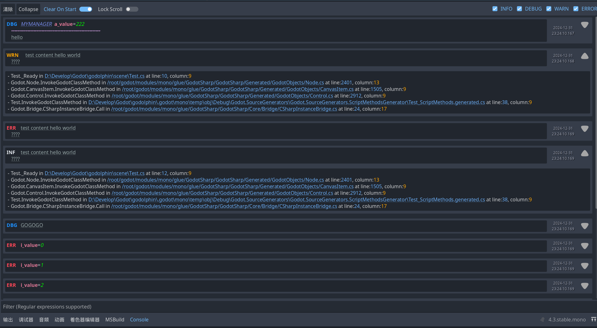
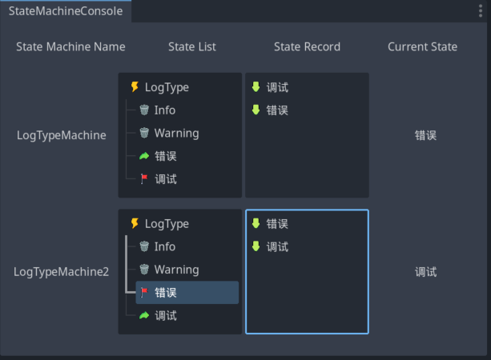

<p align="center">
  
</p>


<h1 align="center">🐬 GODolphin 🐬</h1>

* [Introduce](#introduce)
* [AOP Module](#aop-module)
* [Log Module](#log-module)
  * [Log Example](#runtime-example)
* [State Machine Module](#state-machine-module)
* [How To Install](#how-to-install)

## Introduce

> GODOT's C# toolkit, including the implementation of reactive properties extracted from the [R3](https://github.com/Cysharp/R3) repository, and the very useful tools extracted from [UNITY QFRAMEWORK](https://github.com/liangxiegame/QFramework), with a few minor modifications, and also includes a modern-looking LOG CONSOLE

## AOP Module

---
> Source of demand:
> 
> When I am debugging a program, I often need to insert some code before and after a method when calling it somewhere. So I think of AOP, but this function is a bit redundant. After all, I can manually write the code where I want to insert it.

> Notice: Only allowed during debugging, otherwise it will cause performance problems

### Runtime Example

```csharp
public override void _Ready()
{
	Proxy
		.Instance.SetTarget(this)
		.SetMethod("TestFOOBAR")
		.SetArguments(new object[] { "HELLO" })
		.SetInvocationHandler(LogInvocationHandler.Instance)
		.Invoke();
}

public void TestFOOBAR(string msg) 
{
	msg += " --WHAT";
	Log.Error().Msg(msg).Do();
}
```

You Need Create Your Custom `InvocationHandler`, extend from `AbstractInvocationHandler`
```csharp
public class LogInvocationHandler : AbstractInvocationHandler
{
	public static LogInvocationHandler Instance = new LogInvocationHandler();

	private LogInvocationHandler() { }

	public override void Preprocess()
	{
		GD.Print("PRE");
	}

	public override void PostProcess()
	{
		GD.Print("POST");
	}
}
```

> Suggestions: 
> 
> It is recommended to encapsulate your own static methods directly for easy calling

## Log Module

---
> Source of demand:
>
> When I am developing, I need to log in many locations, but their call stacks may be different, so I want to see the
> call stack of the output. Since the ordinary output of GODOT does not have a call stack, I have this plug-in, and the
> output of GODOT does not have an accurate time display.

the modern-looking LOG CONSOLE:


The code in the above picture:

```csharp
var a = 222;
Log.Debug().Var("a value", a).Sep().Msg("hello").Tag("MYMANAGER").Do();
Log.Warn().Msg("test content hello world").Cr().Msg("????").Do();
Log.Error().Msg("test content hello world").Cr().Msg("????").Do();
Log.Info().Msg("test content hello world").Cr().Msg("????").Do();
Log.Debug().Msg("GOGOGO").Do();
for (var i = 0; i < 10; i++)
{
	Log.Error().Var("i value", i).Do();
}
```

### Runtime Example

! You must call the `Do` method at the end of the chained API, otherwise no output will be generated and the log object
will not be returned to the object pool.

> Normal Info Log
> ```csharp
> Log.Info().Msg("FOO").Cr().Msg("BAR").Do();
> ```

> Debug Variable Log
> ```csharp
> var a = 222;
> Log.Debug().Var("a value", a).Cr().Msg("BAR").Do();
> ```

> Warning Log
> ```csharp
> Log.Warn().Msg("FOO").Sep().Msg("BAR").Do();
> ```

> Error Log
> ```csharp
> Log.Error().Msg("FOO").Sep().Msg("BAR").Do();
> ```

> Line Break API:
>
> ```csharp
> Log.Warn().Cr().Do()
> ``` 
> the `Cr()` is line break

> Dividing Line API:
>
> ```csharp
> Log.Warn().Sep().Do()
> ``` 
> the `Sep()` is dividing line

> Normal Message API:
>
> ```csharp
> Log.Info().Msg("what you say").Do()
> ``` 
> the `Msg()` is normal message

> Specific Variable API:
>
> ```csharp
> Log.Info().Var("your custom variable name", VariableHere).Do()
> ```
> the `Var()` is specific variable

> Tag API:
>
> ```csharp
> Log.Info().Tag("TAG").Msg("HAHA").Do()
> ```
> the `Tag()` is tag 
> 
> (TAG will output at the second, the first is log level, you can call `Tag("")` anywhere, but before `Do()`)

## State Machine Module

State Machine Editor Preview:



Inheritance and chaining can be mixed

Please use this to create new state machine, not `new()`
```csharp
var machine = StateMachineManager.Instance.CreateMachine<LogType>("LogTypeMachine");
```

Chaining  Example A:
```csharp
public partial class StateMachineExample1 : Node
{
	public enum States
	{
		A,
		B,
	}

	public StateMachine<States> sm = new();

	public override void _Ready()
	{
		sm.OnStateChanged(
			(prev, now) =>
			{
				GD.Print($"{prev} => {now}");
			}
		);
		sm.State(States.A)
			.OnCondition(() =>
			{
				return sm.CurrentStateId == States.B;
			})
			.OnEnter(() =>
			{
				GD.Print("ENTER A");
			})
			.OnProcess(() =>
			{
				GD.Print("PROCESS A");
			})
			.OnPhysicsProcess(() =>
			{
				GD.Print("PHYSICS PROCESS A");
			})
			.OnExit(() =>
			{
				GD.Print("EXIT A");
			});
		sm.State(States.B)
			.OnCondition(() =>
			{
				return sm.CurrentStateId == States.A;
			});

		sm.StartState(States.A);

		this.AppendAction(
			this.Delay(
				2f,
				this.Callback(() =>
				{
					sm.SwitchState(States.B);
				})
			)
		);
	}

	public override void _Process(double delta)
	{
		sm._Process(delta);
	}

	public override void _PhysicsProcess(double delta)
	{
		sm._PhysicsProcess(delta);
	}

	public override void _ExitTree()
	{
		sm.Clear();
	}
}
```

Inheritance Example B:
```csharp
public partial class StateMachineExample2 : Node
{
	public enum States2
	{
		A,
		B,
		C,
	}

	public StateMachine<States2> machine = new();

	public class StateA : AbstractState<States2, StateMachineExample2>
	{
		public StateA(StateMachine<States2> machine, StateMachineExample2 target)
			: base(machine, target) { }

		protected override bool OnCondition()
		{
			return machine.CurrentStateId == States2.B;
		}
	}

	public class StateB : AbstractState<States2, StateMachineExample2>
	{
		public StateB(StateMachine<States2> machine, StateMachineExample2 target)
			: base(machine, target) { }

		protected override bool OnCondition()
		{
			return machine.CurrentStateId == States2.A;
		}
	}

	public override void _Process(double delta)
	{
		machine._Process(delta);
	}

	public override void _PhysicsProcess(double delta)
	{
		machine._PhysicsProcess(delta);
	}

	public override void _Ready()
	{
		machine.AddState(States2.A, new StateA(machine, this));
		machine.AddState(States2.B, new StateB(machine, this));

		// * 支持和链式模式混用
		machine
			.State(States2.C)
			.OnEnter(() =>
			{
				GD.Print("C Enter");
			});

		machine.StartState(States2.A);
	}

	public override void _ExitTree()
	{
		machine.Clear();
	}
}
```
 
## How to install

- download the `.zip` and unzip it

- Move the `GODolphin` folder into the `addons` folder of your Godot project, if you don't have this folder you can just
  create one

- In Godot, Under `Projects -> Projects Settings -> Plugins`, Enable the plugin you need whose names contain the
  `GODolphin` prefix.
